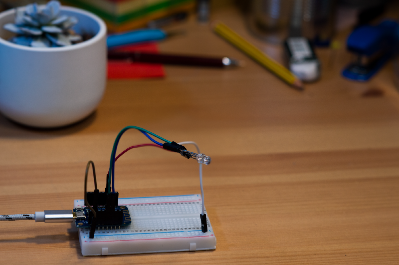

# Introduction

## What we are going to do

We are going to build an Arduino project that mimics a Smart RGB Light Bulb. The
project will connect to the internet on its own and get its configuration from
the Firebase Realtime Database.

## Expected result

