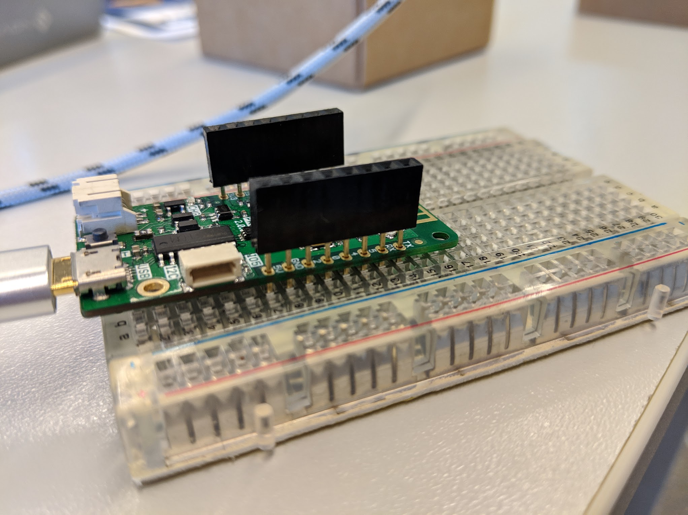

# Arduino

## Arduino

We'll be using the Arduino platform and IDE to write our code

## Install Arduino IDE

Download and install the Arduino IDE.

* [x] [Windows](https://www.arduino.cc/download_handler.php?f=/arduino-1.8.9-windows.exe)
* [x] [Linux 32 bits](https://www.arduino.cc/download_handler.php?f=/arduino-1.8.9-linux32.tar.xz)
* [x] [Linux 64 bits](https://www.arduino.cc/download_handler.php?f=/arduino-1.8.9-linux64.tar.xz)
* [x] [Linux ARM 32 bits](https://www.arduino.cc/download_handler.php?f=/arduino-1.8.9-linuxarm.tar.xz)
* [ ] [Linux 64 bits](https://www.arduino.cc/download_handler.php?f=/arduino-1.8.9-linuxaarch64.tar.xz)
* [ ] [Mac OS X](https://www.arduino.cc/download_handler.php?f=/arduino-1.8.9-macosx.zip)

### Install esp8266 boards definition

Copy this URL

```text
http://arduino.esp8266.com/stable/package_esp8266com_index.json
```

4

1. Open the Arduino IDE preferences
2. In the `Additional Boards Manager URLs`


### Install libraries

#### AdaFruit Neopixel

We are going to use the Library Manager to install this library


1. Open the Library Manager by clicking on the menu Sketch &gt; Include Library &gt; Manage Libraries
2. Search for neopixel
3. Select **Adafruit NeoPixel** by **Adafruit**
4. Click the **Install button**
5. Don't close the Library Manager dialog yet

#### ArduinoJson

We will use the Library Manager again to install this one



1. Open the Library Manager by clicking on the menu Sketch &gt; Include Library &gt; Manage Libraries
2. Search for ArduinoJson
3. Select **Adafruit NeoPixel** by **Adafruit**
4. **Make sure you select the v5 version**
5. Click the **Install button**
6. Don't close the Library Manager dialog yet

#### FirebaseExtended

Installing this libary is a bit different. We are going to download a zip with a stable release and add it to the Arduino IDE.

1. Download the v0.3 release for **firebase-arduino** [here](https://github.com/FirebaseExtended/firebase-arduino/archive/v0.3.zip)
2. Click on Sketch &gt; Include Library &gt; Add .ZIP library
3. Select the zip you just downloaded for firebase-arduino

### Test program

Let's write a program that tests our RGB LED and its connections



```c

```



## References

* [https://github.com/esp8266/Arduino](https://github.com/esp8266/Arduino)
* [https://github.com/FirebaseExtended/firebase-arduino](https://github.com/FirebaseExtended/firebase-arduino)

